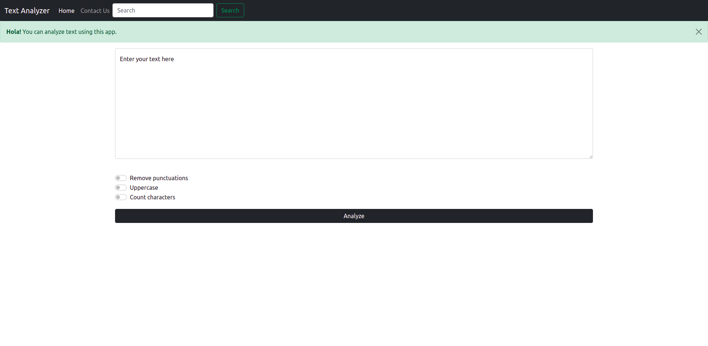
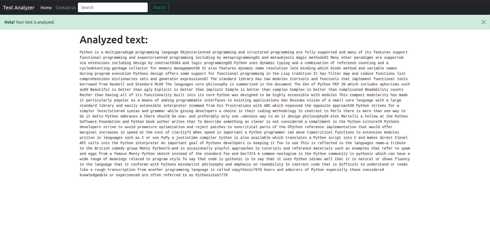
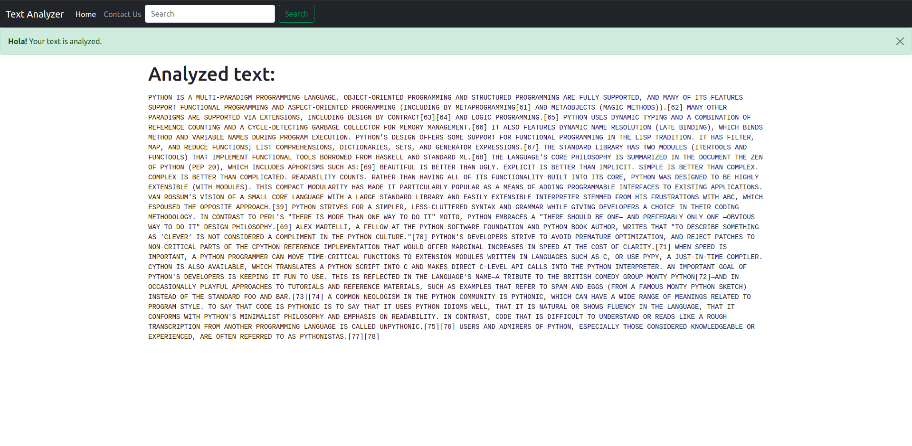
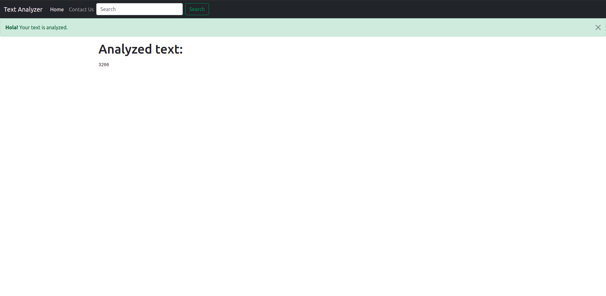

<h1 align="center">DJANGO TEXT ANALYZER</h1>
  <p align="center">
    A simple Django web app for analyzing text.
    <br />
    <a href="https://github.com/DebjitPramanick/Django-Text-Analyzer">View Demo</a>
    ·
    <a href="https://github.com/DebjitPramanick/Django-Text-Analyzer/issues">Report Bug</a>
    ·
    <a href="https://github.com/DebjitPramanick/Django-Text-Analyzer/issues">Request Feature</a>
  </p>
</p>


<!-- TABLE OF CONTENTS -->
<details open="open">
  <summary>Table of Contents</summary>
  <ol>
    <li>
      <a href="#about-the-project">About The Project</a>
      <ul>
        <li><a href="#built-with">Built With</a></li>
      </ul>
    </li>
    <li>
      <a href="#getting-started">Getting Started</a>
      <ul>
        <li><a href="#prerequisites">Prerequisites</a></li>
        <li><a href="#installation">Installation</a></li>
      </ul>
    </li>
    <li><a href="#usage">Usage</a></li>
    <li><a href="#roadmap">Roadmap</a></li>
    <li><a href="#contributing">Contributing</a></li>
    <li><a href="#contact">Contact</a></li>  </ol>
</details>


<!-- ABOUT THE PROJECT -->
## About The Project


<br>

This is a simple web app for analysing text. also this is my first Django mini-project. You can remove punctuation marks, make all the letters uppercase and also count character using this web app.

A list of commonly used resources that I find helpful are listed in the acknowledgements.

### Built With
* [Bootstrap](https://getbootstrap.com)
* [Django](https://www.djangoproject.com/)


<!-- GETTING STARTED -->
## Getting Started

To get a local copy up and running follow these simple example steps.

### Prerequisites

This is an example of how to list things you need to use the software and how to install them.
* [Python3](https://www.python.org/downloads/)

### Installation

1. Clone the repo
   ```sh
   git clone https://github.com/DebjitPramanick/Django-Text-Analyzer.git
   ```
3. Install Django
   ```sh
   pip  install  django
   ```
   

<!-- USAGE EXAMPLES -->
## Usage

Here are some examples of how my app works.
<br>

<br>

<br>

<br>


<!-- ROADMAP -->
## Roadmap

See the [open issues](https://github.com/DebjitPramanick/Django-Text-Analyzer/issues) for a list of proposed features (and known issues).


<!-- CONTRIBUTING -->
## Contributing

Contributions are what make the open source community such an amazing place to be learn, inspire, and create. Any contributions you make are **greatly appreciated**.

1. Fork the Project
2. Create your Feature Branch (`git checkout -b feature/AmazingFeature`)
3. Commit your Changes (`git commit -m 'Add some AmazingFeature'`)
4. Push to the Branch (`git push origin feature/AmazingFeature`)
5. Open a Pull Request


<!-- CONTACT -->
## Contact

Twitter - [@P_Debjit](https://twitter.com/P_Debjit) 
<br>
LinkedIn - [Debjit Pramanick](https://www.linkedin.com/in/debjit-pramanick-7a6a971b1/)

Project Link: [https://github.com/DebjitPramanick/Django-Text-Analyzer](https://github.com/DebjitPramanick/Django-Text-Analyzer)